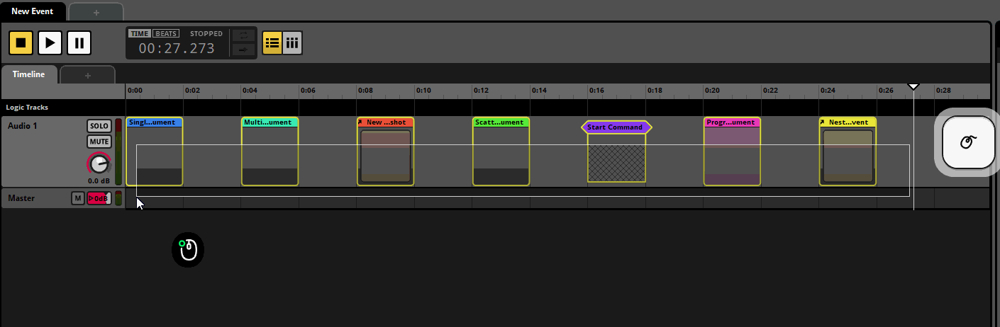
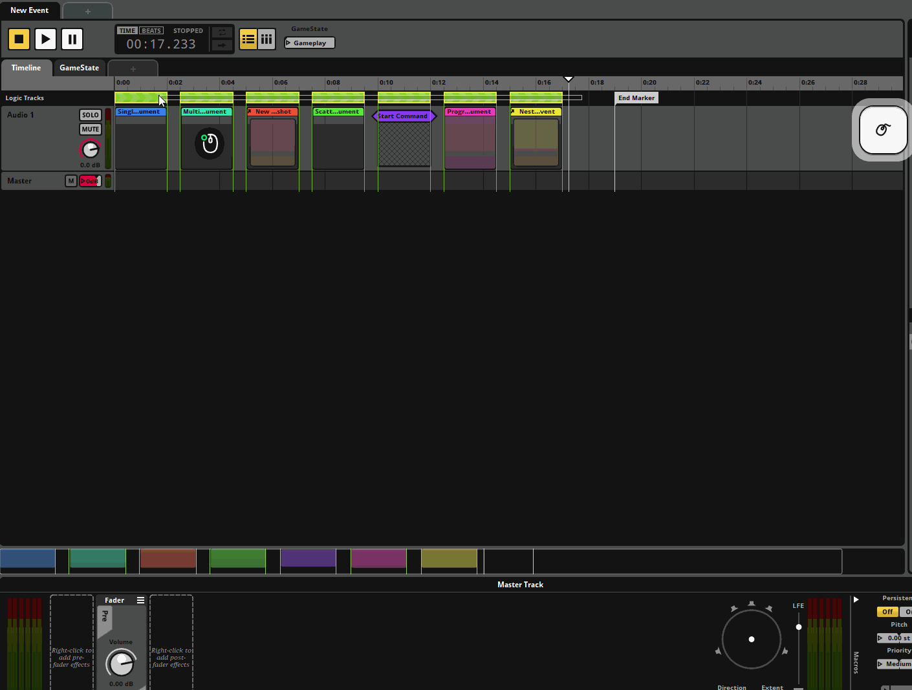
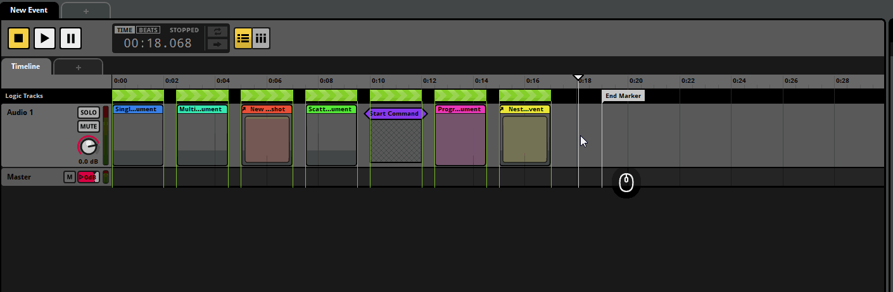
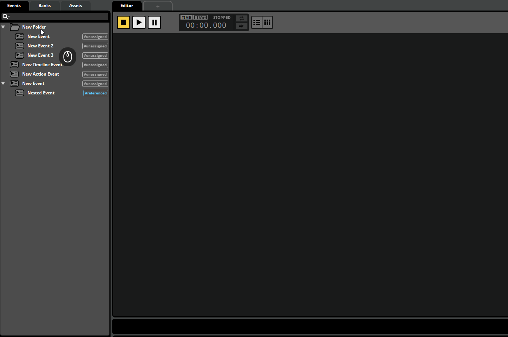
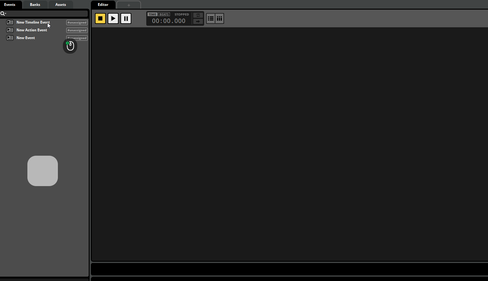
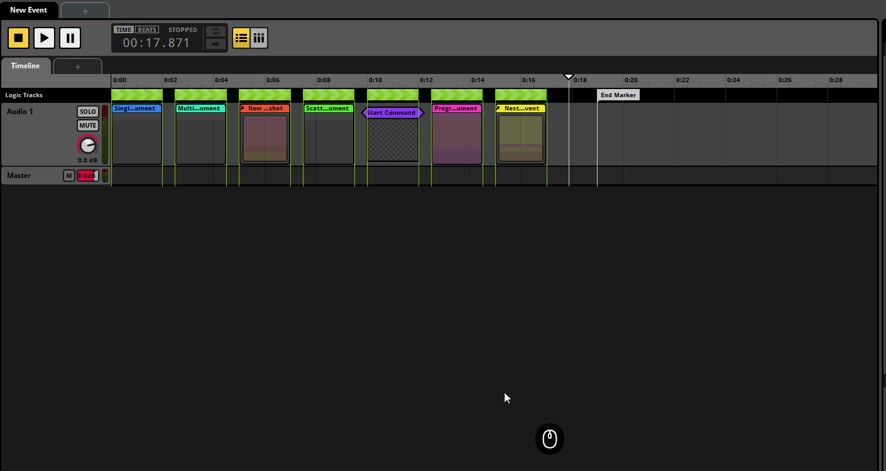

# FMOD Hotkeys

A collection of quality-of-life scripts for FMOD Studio that turn repetitive editor workflows into single keystrokes - creating regions and markers on the timeline, batch editing transitions, generating events and labelled parameters, organizing banks, coloring and renaming selections, and saving/building with one press. Everything is invoked through customizable hotkeys and works across multiple selections at once.

Please feel free to request new functionalities or suggest fixes to help me improve this project

See **[FEATURES.md](FEATURES.md)** for the full hotkey list.

## Installing

Double-click **Install-FmodHotkeys.bat** (Windows) to copy every `.js` script into `%LOCALAPPDATA%\FMOD Studio\Scripts`, which loads them for **all** projects. Run it again after any script edit, then "Scripts > Reload" in FMOD Studio. To uninstall, delete the scripts from that folder.

Scripts prefixed with `NOM_` are courtesy of <https://github.com/nightonmars/FMOD-Organisation-scripts> - credit and thanks to nightonmars!

Advanced users can skip the installer entirely - FMOD's own documentation explains how the script directories work if you'd rather wire things up yourself.

## Script Showcase

- **Timeline Regions & Markers** (`FmodHotkeys_Regions.js`) - loop, magnet, transition and destination regions plus destination markers, created from your timeline selection in one press

- **Event Creation** (`FmodHotkeys_NewEvents.js`) - new events with timeline or action sheets already set up

- **Transition Editing** (`FmodHotkeys_BatchEditTransitions.js`) - batch re-target transitions, add/edit/clear parameter conditions, switch AND/OR trigger logic, and tweak condition values directly

- **Timeline Navigation** (`FmodHotkeys_TabToNextInstrument.js`) - Pro Tools-style cursor snapping to the next instrument start (Tab) and previous instrument end (Shift+Tab)

- **Selection Organization** (`FmodHotkeys_RandomColor.js`, `FmodHotkeys_Rename.js`) - contrasting colors for any selection, and an upgraded batch rename dialog with engine-safe transforms and incremental numbering

- **Project Actions** (`FmodHotkeys_ProjectActions.js`) - refresh assets, save + build all platforms in one key
- **Bank & Parameter Organization** (`NOM_*.js`) - add single or multiple events to banks, create banks, and a quick labelled parameter generator

- **Developer Tools** (`ObjectIdentifier.js`) - dump the structure of any selected object into the console
